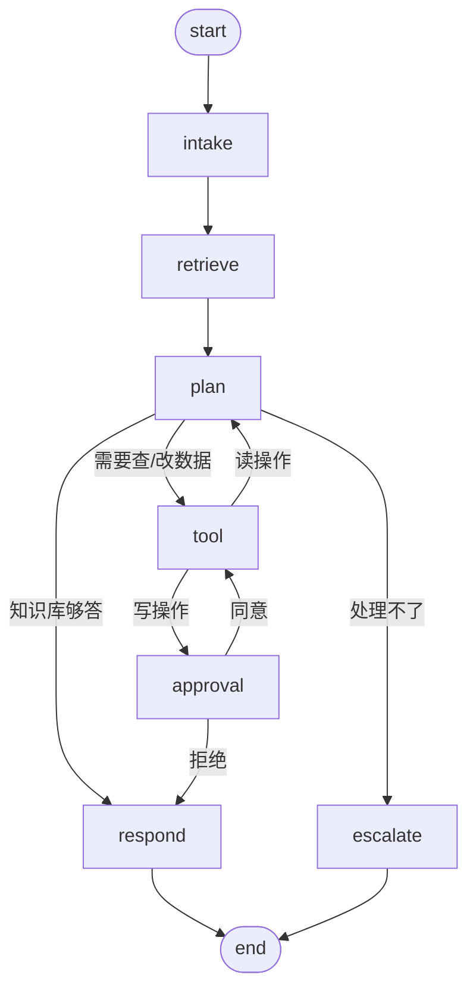

# Agent 状态图

> 状态图是 Agent 和"聊天机器人"的分界线。没有图，模型只能靠提示词自己决定下一步，
> 出错时无法定位；有了图，每一步都在固定节点上跑，中断、恢复、审批才有落点。

## 一、节点定义（8 个）

| 节点 | 输入 | 做什么 | 输出 |
|---|---|---|---|
| `intake` | 用户问题、会话历史 | 判断意图（知识问答/查数据/改数据/闲聊/转人工）、估优先级 | `intent`、`priority` |
| `retrieve` | 问题 | 混合检索知识库（向量 + 关键词 + RRF 融合） | `retrievedChunks` |
| `plan` | 问题、检索结果、已执行工具 | 决策下一步：`respond` / `tool` / `escalate`；决定调哪个工具、传什么参数 | `nextAction`、`toolCall` |
| `tool` | 工具编码与参数 | 过七道关执行工具（身份/权限/幂等/审批/超时/重试/审计） | `toolResults` |
| `approval` | 待审批的工具调用 | **中断，等人工。** 状态落库，进程可以重启 | `approvalDecision` |
| `respond` | 全部上下文 | 组织答案，附引用编号 | `answer`、`references` |
| `escalate` | 原因 | 转人工：创建或指派工单 | `ticketId` |
| `end` | — | 汇总与落库 | — |

`plan` 是唯一做决策的节点，其余节点都只做一件事。
把决策收在一个节点里，是为了让"模型为什么这么走"可复盘 —— 出问题时只需要看 `plan` 的输入输出。

## 二、条件边（共 10 条）

逐条说明：

| # | 边 | 条件 |
|---|---|---|
| 1 | `start` → `intake` | 无条件 |
| 2 | `intake` → `retrieve` | 无条件（闲聊类也会走一次检索，命中为空就自然跳过） |
| 3 | `retrieve` → `plan` | 无条件 |
| 4 | `plan` → `respond` | 检索结果足以回答，或模型判定为闲聊 |
| 5 | `plan` → `tool` | 需要查数据或改数据 |
| 6 | `plan` → `escalate` | 超出职责、用户要求转人工、轮次耗尽 |
| 7 | `tool` → `approval` | **这次是写操作**（`read_only=0`） |
| 8 | `tool` → `plan` | 这次是读操作，回到决策节点继续 |
| 9 | `approval` → `tool` | 人工点了同意 |
| 10 | `approval` → `respond` | 人工点了拒绝，直接给用户一个交代 |
| — | `respond` → `end` | 无条件 |
| — | `escalate` → `end` | 无条件 |

### 全局兜底

**`round > maxRounds`（默认 6）→ 无条件走 `escalate`。**

这条兜底必须有。模型很容易陷入"查了不够 → 再查 → 还不够"的循环，
一次提问就能烧掉几万 token，而且最终答不出来。轮次上限是保险丝，不是优化项。

## 三、Checkpoint 策略

| 项 | 取值 | 理由 |
|---|---|---|
| 落库时机 | 每个节点执行完成后落一次 | 共 8 个检查点，任意一步崩了都能从上一个检查点恢复 |
| 存储 | `langgraph4j-mysql-saver` 落 MySQL | 轨迹可以直接用 SQL 查，排错和演示都方便 |
| threadId | **用 `runId`** | 见下 |

### 为什么 threadId 必须用 runId

如果用 `sessionId` 当 threadId：

- 同一会话的第二轮会**覆盖**第一轮的状态；
- 断点续跑会从错误的位置恢复；
- 表现出来就是"审批通过后，执行的其实是上一轮的操作"。

这个 bug 极隐蔽 —— 因为每一步看起来都"成功"了，只是成功在了错的地方。
所以一开始就按 `runId` 来，不要等出问题再改。

## 四、一次完整的写操作长这样

以"把工单 TK202610010001 转派给王五"为例：

| 步 | 节点 | 发生了什么 | 落哪张表 |
|---|---|---|---|
| 1 | `intake` | 判定意图 = 改数据 | `agent_run` |
| 2 | `retrieve` | 检索到转派相关的内部规范 | `kb_retrieval_log` |
| 3 | `plan` | 决定调 `ticket_assign`，参数 `{ticketId, assigneeId}` | `agent_message` |
| 4 | `tool` | 过七道关，判定为写操作 → 转审批 | `sys_audit_log` |
| 5 | `approval` | **中断**，等主管点同意 | `agent_approval` |
| — | — | （此时进程可以重启，状态不丢） | — |
| 6 | `tool` | 幂等键命中检查 → 执行 → 写工单 | `ticket`、`ticket_assign_log` |
| 7 | `respond` | 告诉用户"已转派给王五" | `agent_message` |
| 8 | `end` | 汇总成本与耗时 | `agent_run`、`sys_metric_daily` |

## 五、变更记录

| 日期 | 版本 | 变更 |
|---|---|---|
| 阶段 0 | v1 | 首次定稿，8 节点 + 10 条边 + 全局兜底 + runId 约定 |